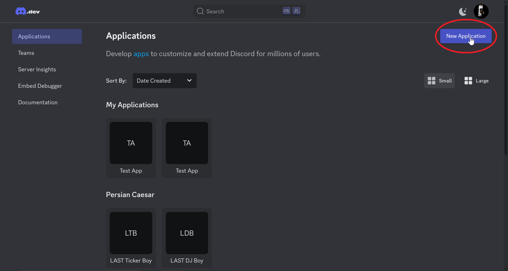
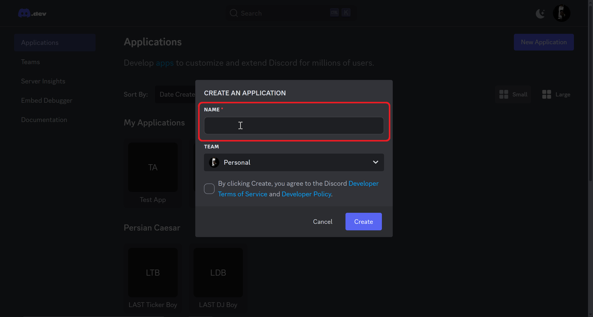
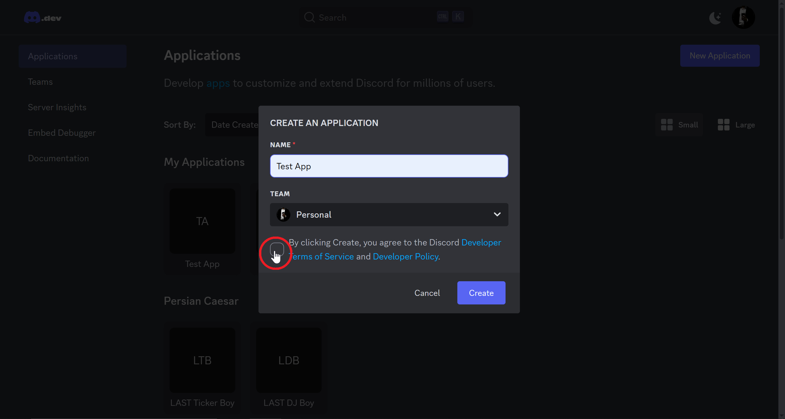
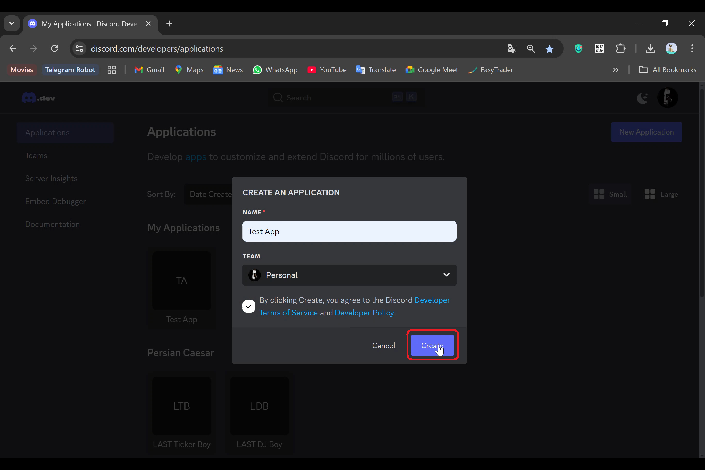
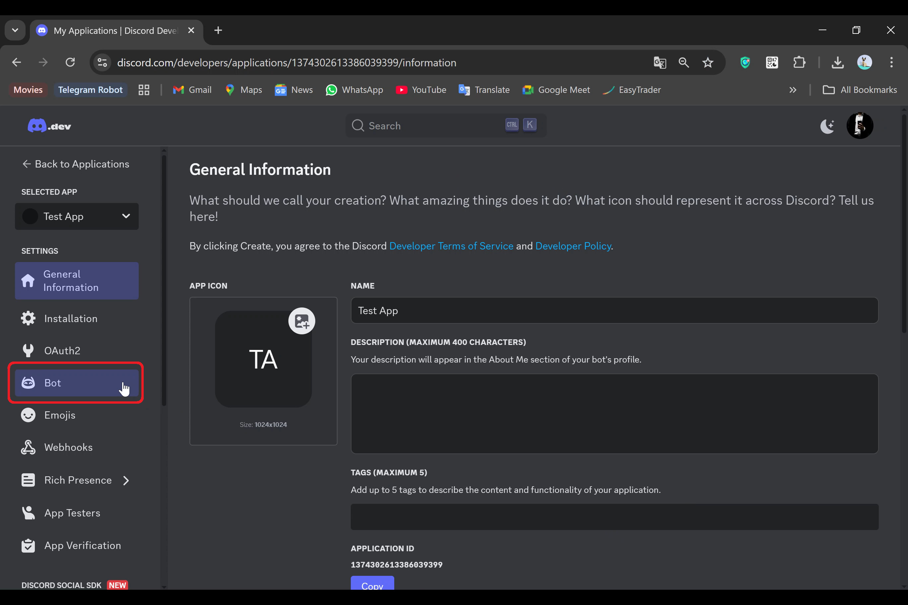
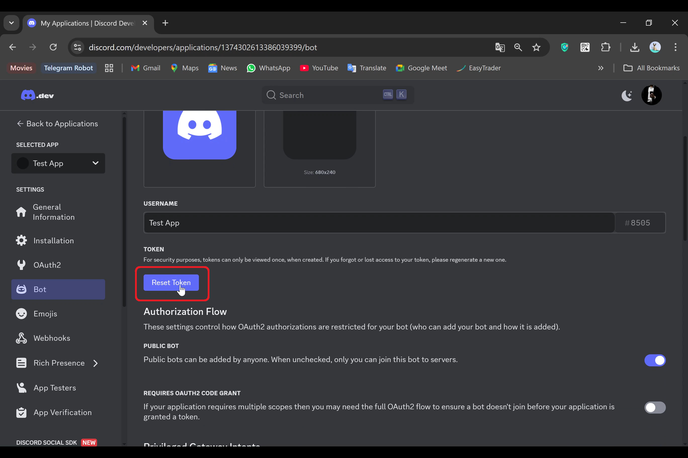
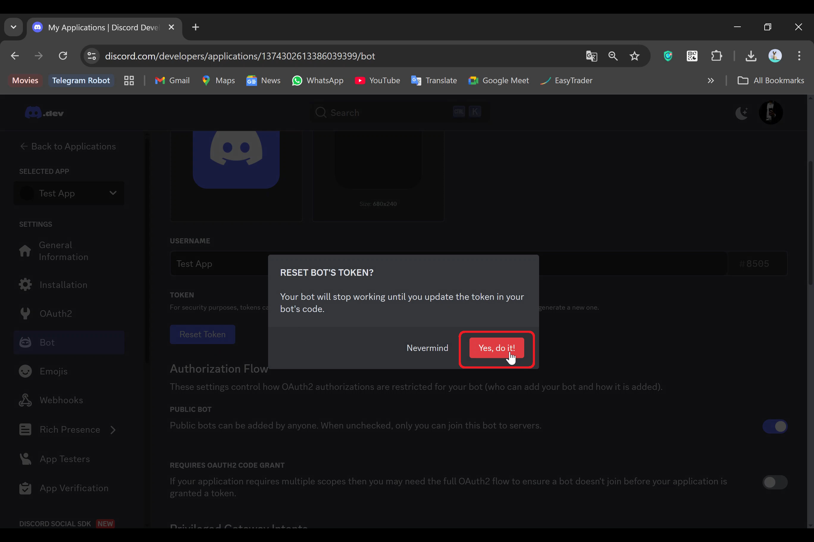
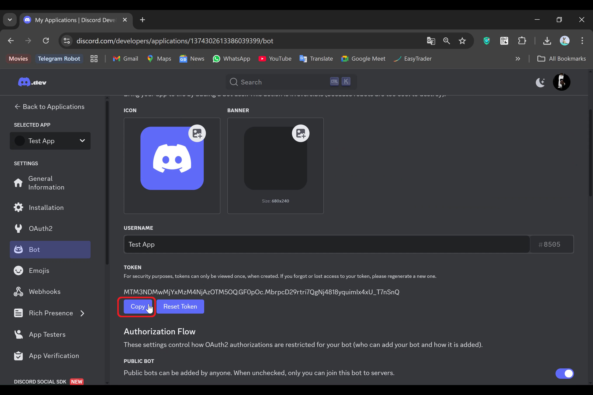

**فصل ۱: مقدمه و آمادهسازی محیط کار**  
---

### **۱.۱ برنامه نویسی چیست؟**  
برنامه نویسی یعنی نوشتن دستوراتی که کامپیوتر آنها را اجرا میکند تا یک خروجی یا عملکرد خاص ایجاد شود.  
- **چرا دیسکورد و Node.js؟**  
  - دیسکورد یک پلتفرم محبوب برای ساخت جوامع آنلاین است و رباتها میتوانند امکاناتی مثل مدیریت خودکار، بازیها یا تعاملات هوشمند را به سرورها اضافه کنند.  
  - **Node.js** یک محیط اجرایی برای جاوااسکریپت است که به شما اجازه میدهد کدهایتان را خارج از مرورگر (مثلاً روی سرور) اجرا کنید. این ابزار برای ساخت رباتهای دیسکورد با کتابخانه `discord.js` ایدهآل است.  

---

### **۱.۲ ابزارهای مورد نیاز**  
برای شروع، باید ابزارهای زیر را آماده کنید:  

#### **۱.۲.۱ نصب Node.js و npm**  
1. به سایت [Node.js](https://nodejs.org) بروید.  
2. نسخه **LTS** (پشتیبانیشده) را دانلود و نصب کنید.  
3. پس از نصب، ترمینال/CMD را باز کرده و دستور زیر را وارد کنید تا از نصب موفقیت آمیز مطمئن شوید:  
   ```bash
   node -v  # باید نسخه Node.js نمایش داده شود (مثلاً v18.12.1)
   npm -v    # باید نسخه npm نمایش داده شود (مثلاً 8.19.2)
   ```

#### **۱.۲.۲ ویرایشگر کد: VS Code**  
- VS Code یک ویرایشگر رایگان و محبوب است. آن را از [این لینک](https://code.visualstudio.com) دانلود و نصب کنید.  

#### **۱.۲.۳ ساخت بات در دیسکورد**  
1. به [پنل توسعه دهندگان دیسکورد](https://discord.com/developers/applications) بروید.  
2. روی **New Application** کلیک کنید و نامی برای ربات انتخاب کنید.  
3. به بخش **Bot** در منوی سمت چپ بروید و روی **Add Bot** کلیک کنید.  
4. **توکن (Token)** ربات را کپی و در جای امن نگه دارید (این توکن مانند رمز عبور ربات است!).  

  
  
  
  
  
  
  
  
  

---

### **۱.۳ شروع اولین پروژه**  
1. یک پوشه جدید برای پروژه بسازید (مثلاً `my-first-bot`).  
2. در VS Code، این پوشه را باز کنید.  
3. در ترمینال VS Code، دستور زیر را اجرا کنید تا پروژه Node.js راهاندازی شود:  
   ```bash
   npm init -y
   ```  
4. کتابخانه `discord.js` را نصب کنید:  
   ```bash
   npm install discord.js
   ```  

---

### **۱.۴ تست اتصال ربات به دیسکورد**  
یک فایل `index.js` ایجاد کرده و کد زیر را در آن بنویسید:  
```javascript
const { Client, GatewayIntentBits } = require('discord.js');
const client = new Client({ intents: [GatewayIntentBits.Guilds, GatewayIntentBits.GuildMessages] });

client.on('ready', () => {
  console.log(`ربات با موفقیت لاگین کرد! نام: ${client.user.tag}`);
});

client.on('messageCreate', (message) => {
  if (message.content === 'سلام') {
    message.reply('سلام! چطوری؟');
  }
});

client.login('TOKEN_خود_را_اینجا_قرار_دهید');
```  
- توکن ربات را جایگزین `TOKEN_خود_را_اینجا_قرار_دهید` کنید.  
- ربات را با دستور زیر در ترمینال اجرا کنید:  
  ```bash
  node index.js
  ```  
- اگر همه چیز درست باشد، ربات در دیسکورد آنلاین میشود و به پیام «سلام» پاسخ میدهد!  

---

### **تمرین عملی فصل ۱**  
۱. یک ربات جدید در دیسکورد ایجاد کنید و توکن آن را دریافت کنید.  
۲. کد `index.js` را طبق مثال بالا بنویسید و ربات را اجرا کنید.  
۳. در سرور دیسکورد، به ربات پیام «سلام» بفرستید و پاسخ آن را بررسی کنید.  

---

### **مهمترین نکات**  
- توکن ربات را **هرگز** با کسی به اشتراک نگذارید!  
- اگر ربات آنلاین نمیشود:  
  - مطمئن شوید توکن را درست جایگذاری کردهاید.  
  - اینترنت شما متصل است.  
  - ربات را به سرور دیسکورد اضافه کردهاید (از طریق لینک **OAuth2** در پنل توسعهدهندگان).  

در فصل بعدی، با مفاهیم پایه جاوااسکریپت آشنا خواهید شد! 🚀